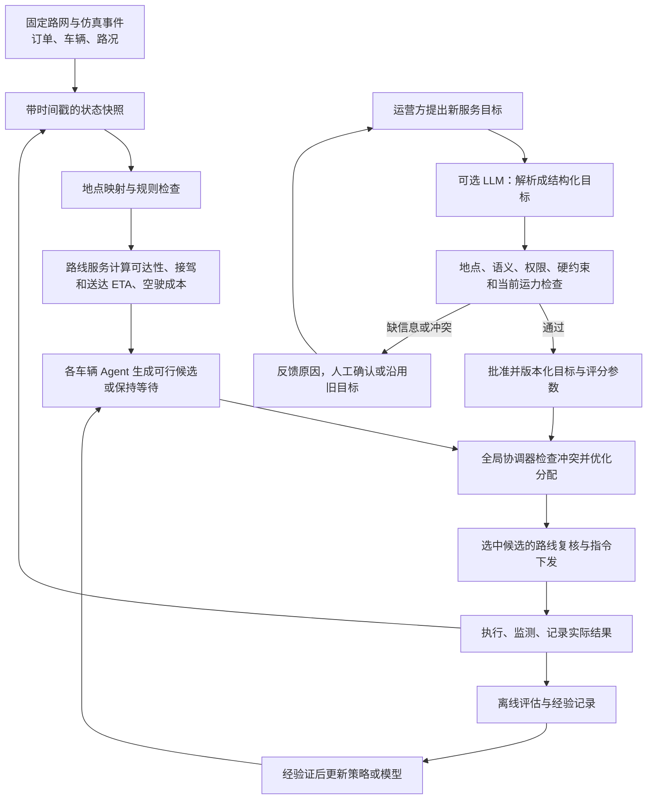

# 第三次课 Agent 工作流完善稿

状态：供与 Chen 讨论的研究设计稿；尚未实现或验证。  
依据：[第三次课录屏及逐字稿](https://meeting.tencent.com/cw/l5GXJpae01)、[ei论文.pdf](/Users/didi/Documents/personalcodexfile/第二次课/ei论文.pdf)、[后续论文思路与系统结构.md](/Users/didi/Documents/personalcodexfile/第二次课/output/pdf/后续论文思路与系统结构.md)、[11篇论文阅读整理.md](/Users/didi/Documents/personalcodexfile/第二次课/output/paper/11篇论文阅读整理.md)、[两个Demo复现记录.md](/Users/didi/Documents/personalcodexfile/第二次课/output/paper/两个Demo复现记录.md)及本项目此前的选题讨论。

## 1. 课堂提案到底是什么

Chen 在 **31:33—36:05** 画的是单车 Agent 的循环：车辆到达位置后进入等待状态；订单事件到来时，根据地图与订单条件判断接单或拒绝；接单后执行任务，检查后续是否有顺路订单；完成后利用结果改进下一次决策，再回到等待。**29:50—30:20** 他明确说举的清华、北大例子“不是拼车”，重点是前一单结束后的顺路衔接。**37:35—38:53** 他确认这是一条工作流，大模型只需在某些环节调用。**44:02—56:33** 又把数据集、车辆与订单的数学关系、Agent 框架、地图表达、约束与优化器接了起来。

本稿保留这条主线，但将单车候选与车队最终分配分开，将路线估计放在优化之前，并把“知识库记录”“奖励定义”“模型学习”区分为三件事。它们在录屏中还只是讨论设想，不能直接写成已验证的创新或实验结果。

## 2. 建议先固定研究边界

首版问题定义为：**已知道路图上的动态非拼车网约车调度**。订单随时间到达，车辆位置和路况会变化；每车同一时刻最多服务一位乘客。已有订单的接送承诺由规则约束，新目标不能擅自取消。车辆完成上一单后，可以提前评估下一单能否在承诺时间内接上；这叫连续接单，不能写成同时载客的拼车。

研究问题收敛为：**在路线成本与服务承诺约束下，车辆如何提出候选，全局协调器如何分配，业务目标变化时如何安全地更新评分规则？** 其中可以优先研究“车辆侧候选 + 全局协调”机制，或“目标检查与反馈修正”机制；两个都能放进系统，但论文应选一个作为主要待验证贡献。LLM、RAG、预训练模型对比可作为可插拔实验，不要求首版全部实现。

## 3. 完善后的运行工作流

### A. 环境与事实层

- **路网**：节点、道路边、行驶方向、合法上车点、当前通行时间和封路信息；地点名称须对应明确的节点或区域。每条动态数据带采集时间和有效期。
- **车辆**：位置、空闲／接驾中／载客中／离线状态、当前路线、已接受订单、承诺的接驾和送达条件。
- **订单**：产生时间、上车点、下车点、等待时间、取消状态和适用服务规则。未来订单不可提前泄露给在线策略；若用预测，要标为预测。
- **实验记录**：地图版本、事件序列、随机种子、路况版本、算法版本和目标版本。所有被比较方法读取同一份事件流。

第三次课 **45:12—47:16** 建议从小型自建地图和三辆车开始。这里应明确“100 km × 100 km”是物理范围还是网格尺寸；首版可先用便于手工核查的小路网，逐步增加规模。地图、车位和订单事件在同一组对比实验中固定，不让模型每轮改图。

### B. 路线与成本层

路线模块对每个可考虑的“车—订单”组合，先计算可达性、从车辆当前位置到上车点的预计时间、接送路线、送达时间、空驶距离，以及对已有任务的影响。不可达、接驾时间超限、冲突既有承诺的组合直接标为**不可行**。可行组合才计算成本。

一个首版成本可写为：

`c(i,j,t) = w1 × 预计接驾时间 + w2 × 空驶距离 + w3 × 预计送达延误 + w4 × 区域服务偏差`

各项单位、归一化方法和权重范围需要事先定义。**硬约束不进入加权求和**，不能靠高权重“尽量”满足。Dijkstra／A* 可用于这里的路线和时间估计；它们不能单独完成车队订单分配。

### C. 单车 Agent：把 31:33 的循环改成可执行状态机

| 当前状态 | 触发事件 | 本车动作 | 下一状态 |
|---|---|---|---|
| 空闲等待 | 新订单、路况更新或周期触发 | 读取自己的位置和允许看到的候选，向路线服务查询成本；提交候选或“暂无可行候选” | 等待全局分配 |
| 等待全局分配 | 协调器选择本车 | 锁定订单与承诺，复核路线 | 前往上车点 |
| 等待全局分配 | 协调器未选择 | 保持空闲，等待新事件 | 空闲等待 |
| 前往上车点 | 接到乘客／乘客取消／路况突变 | 更新任务状态；异常按预先定义的规则处理 | 载客中／异常处理 |
| 载客中 | 路况变化 | 允许重算行驶路线，同时检查送达承诺；不擅自放弃乘客 | 载客中 |
| 载客中且无预留下一单 | 新订单 | 仅评估当前送达后的接驾可行性；协调器可预留最多一单，当前乘客的承诺优先 | 载客中 |
| 载客中 | 到达目的地 | 记录实际时间与服务结果；有预留下一单则复核接驾路线，否则释放车辆 | 前往上车点／空闲等待 |

课堂的“接单或拒绝”在实现中宜解释为**提出或不提出可行候选**。一辆车不能单方面占用订单，也不能在已接单后为了更近的新订单随意拒载。多辆车争同一订单由协调器决定。若要允许上车前换车，必须先规定可换的时点、额外等待上限与乘客告知规则；首版可以禁止换车。

这一步即使没有训练模型，也已经是一个完整的**状态机 + 滚动优化**。若要称为 MDP，需要明确状态 `s`、动作 `a`、转移 `P(s'|s,a)` 和奖励 `r`；若要称为多智能体强化学习，还需真正训练与评估策略。录屏 **34:45—35:50** 所说的“把较优规则放入知识库”，可以先做经验日志；日志并不会自动变成奖励函数，也不会自动让模型学会最优路线。

### D. 全局协调器

每一轮收集各车候选，建立二分匹配或整数规划。定义 `x(i,j)=1` 表示将订单 `j` 分配给车辆 `i`。首版至少保证：每个订单最多分给一辆车；非拼车车辆同时载客最多一人，且预留的下一单总数最多一单；只选择通过路线与承诺检查的候选；无法服务的订单保留为待服务或按规则结束，不伪造成功。

优化目标可以是“可行候选总成本 + 未服务订单惩罚 + 经定义的公平性项”。求解超时则执行同样满足硬约束的确定性回退策略，并记录超时。协调器输出**车—订单分配**；路线模块为选中的组合输出最终路线和 ETA。这样补上了课堂 **56:33** 中“优化器后才产出路线”的前置依赖：优化前需要候选路线成本，优化后还要复核并输出选中路线。

### E. 低频目标解析与反馈

当运营方改变服务目标时，再调用可选的 LLM，把自然语言转换为结构化字段：服务区域、有效时间、指标、优先级、允许的参数范围、依据和待确认项。规则库检查地点是否存在、参数是否有授权来源、要求是否互相冲突，以及当前车辆和承诺是否允许实现。模糊的“不要等太久”不能由模型凭空生成上限。通过检查的目标附版本号进入协调器；失败时返回具体原因，沿用上一版已批准目标或请求人工决定。

RAG 只适合检索**相对稳定**的规则、地点别名和历史案例；车辆实时位置、当前订单和路况仍来自状态服务。RAG 是否节省 token 与时间要测量，不能把“引入 RAG”直接写成性能提升。普通订单到来不必等待 LLM。模型不可用时，系统使用已批准目标和最新状态继续调度。

### F. 反馈与可选学习

每次执行记录预测与实际差值、订单结果、违规情况、计算时间和成本。经验库保存的是**案例和可审计结果**。若后续真正加入学习策略，再单独定义奖励、训练集／测试集、训练过程和模型更新频率；训练不能在测试数据上调参。首版可以先使用固定规则和优化器，不训练 CNN、GNN 或 MARL。

## 4. 用一个例子核对流程

1 号车正载客前往清华，新的北大上车订单出现。路线模块估计 1 号车完成清华送达后去北大接客的时间；若新订单的接驾承诺允许，1 号车可提出**下一单候选**。2、3 号车也各自提出候选。协调器比较所有可行候选并给这笔订单唯一归属。1 号车在完成当前送达前不接第二位乘客。若所有车都赶不上承诺，系统将订单记为未服务或触发已定义的异常处理，而不是让 LLM 自行放宽时限。

## 5. 实验怎么验证这条工作流

先固定同一张地图、车位、订单到达序列、交通事件和目标规则；用多个随机种子重复。按阶段比较：

| 方法 | 作用 |
|---|---|
| 最近可行车辆 | 简单派单基线，使用相同路线数据和硬约束 |
| 集中式最小成本分配 | 检查多车协调本身的收益 |
| 本稿的车辆候选 + 全局协调 | 检查局部候选生成的增益与开销 |
| 在同一调度器上增加目标检查与反馈 | 单独检验目标更新机制 |
| 单 LLM 直接建议分配（可选） | 检查在线模型调用的质量、延迟和 token 成本；仍需同样的最终硬约束检查 |

若比较不同预训练模型，保持同一提示、工具、地图、订单、预算和输出检查；这是第二层实验。模型参数量相近可以减少一类差异，但不能替代同场景、同信息和同约束的控制。A*／Dijkstra 只在路线层比较，不能当作整个调度系统的唯一基线。AIFP 与 GridRoute 是路径 Demo；本地记录中的 AIFP 33 次调用约 127.8 秒、GridRoute 10 题只有 3 题产出有效路径，提示在线逐步调用的代价和输出失败问题，**不是多车调度实验结果**。

主指标：订单服务率、已服务订单的平均和 P95 接驾等待时间、未服务／积压量及其等待时长、已有承诺违反次数、空驶距离、车队负载方差、每轮调度 P95 耗时。若启用 LLM，再记录目标解析正确率、澄清率、API 调用量、token 成本和从目标提出到生效的时间。**积压量不必强行等于零**：运力不足时应如实报告其规模和持续时间。可解释性用可复核的决策理由和错误定位正确率评价，不能只因生成了一段解释就认为系统透明。

## 6. 下一步交给 Chen 审阅的三个决定

1. **首版是否坚持非拼车。** 本稿按录屏 29:53 的回答和此前项目讨论，采用非拼车、允许连续接单的设定。
2. **论文主贡献选在哪里。** 建议优先在“路线感知、承诺约束下的车辆候选与全局协调”或“动态目标的检查与反馈修正”中选一个主贡献，另一个作为系统组件。两者同时主攻，实验规模会显著扩大。
3. **是否真的训练多智能体策略。** 若只运行状态机、规则和优化器，论文应据实称为多车辆 Agent 协调系统；若要称 MARL，需要另做训练、收敛、泛化和消融验证。

建议先给老师看本稿的**第 2—3 节**，确认任务设定和模块顺序，再确定数据集及实验分组。第三次课末尾 **01:09:17—01:09:37** 的要求是先写中文引言、相关工作，并提交 Markdown 实验流程供其补充；本稿可以作为那份实验流程的讨论基础。
